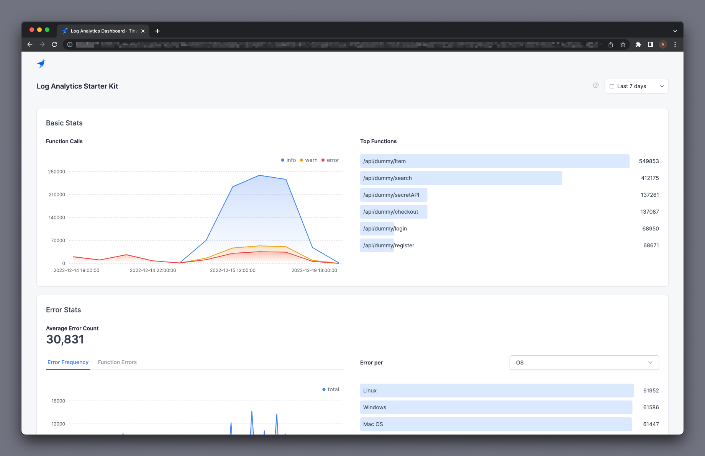
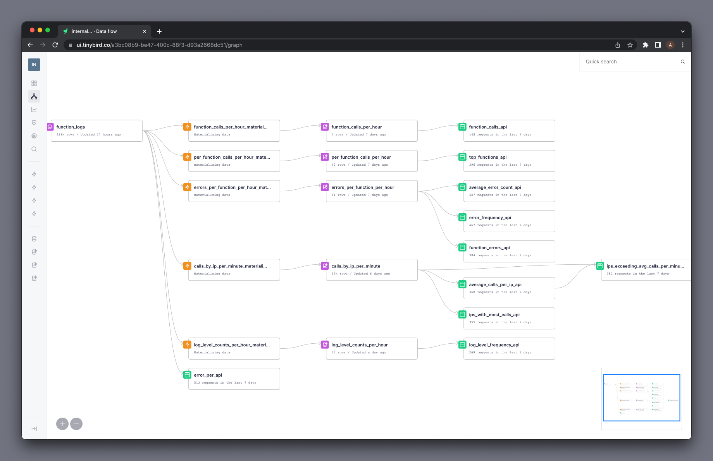

  

# Tinybird Log Analytics Starter Kit

Data can help developers build better software, but it can be hard to find data tools that are easy to integrate, scale with you as you grow, and are flexible enough to meet different demands. This Stater Kit provides an example for you can build your own logging & telemetry solution powered by [Tinybird](https://www.tinybird.co/).

This is an opinionated Starter Kit that uses Web Applications as the example, but you can use this kit to bootstrap logging for _any_ software project. Take this kit and make it your own!

## What's in the box?

This Starter Kit includes:

- [Tinybird](https://www.tinybird.co/) data project
- Analytics Dashboard built with [Next.js](https://nextjs.org/) & [Tremor](https://www.tremor.so/)
- Example Log Capture implementations
  - TypeScript & Next.js Logger + example [Vercel](https://vercel.com/) functions
  - Python & FastAPI Logger

### Tinybird Data Project

The [Tinybird](https://www.tinybird.co/) data project includes all of the Tinybird resources you need to ingest, analyze and publish your logs. This includes [Data Sources](https://www.tinybird.co/docs/concepts/data-sources.html), [Pipes](https://www.tinybird.co/docs/concepts/pipes.html), [Materialized Views](https://www.tinybird.co/docs/guides/materialized-views.html), and [APIs](https://www.tinybird.co/docs/concepts/apis.html).

### Analytics Dashboard

The Analytics Dashboard is an example of how of you can build your own frontend to visualize the data from Tinybird.

The dashboard is implemented using [Next.js](https://nextjs.org/) & [Tremor](https://www.tremor.so/). All of the charts on the dashboard consume data over the HTTP API Endpoints that are publish from [Tinybird](https://www.tinybird.co/).

There is no caching or frontend magic, every chart is consuming live data in real time.

### Example Log Capture

All examples of capturing logs use the [Tinybird's Events API](https://www.tinybird.co/docs/guides/high-frequency-ingestion.html), sending logs as JSON via a standard HTTP POST request. Because this is simply JSON over HTTP, you can use this approach to integrate any framework, language or application to send data to [Tinybird](https://www.tinybird.co/).

Each logger exposes 3 methods `info`, `warn` and `error` that can be used to capture log messages with different log levels. Each one in turn calls the `log` method, which captures additional information about the incoming request.

Note that each logger expects an Environment Variable `TINYBIRD_TOKEN` to authenticate the request to Tinybird. You can copy this token from your Tinybird account by logging into the Tinybird UI.

#### TypeScript & Next.js

In [logger.ts](./logger-examples/typescript-nextjs/logger.ts) you'll find a simple reference implementation for a log capture class in TypeScript. This is built with [Next.js](https://nextjs.org/) in mind, but could be adapted to any other framework.

##### Vercel Functions

An example Vercel Function is included at [getProductExample.ts](./logger-examples/typescript-nextjs/getProductExample.ts). This function simply demonstrates how to use the logger in a function.

#### Python & FastAPI

In [logger.py](./logger-examples/python-fastapi/logger.py) you'll find a simple reference implementation for a log capture class in Python. This is built with [FastAPI](https://fastapi.tiangolo.com/) in mind, but could be adapted to any other framework.

##### FastAPI Endpoint

An example FastAPI Endpoint is included at [main.py](./logger-examples/python-fastapi/main.py). This endpoint simply demonstrates how to use the logger in a function.

## Deploy

There are two components to this Starter Kit that you need to deploy.

### 1. Tinybird Data Project

Use the button below to deploy this Starter Kit to Tinybird.

### 2. Analytics Dashboard

Use the button below to deploy this Starter Kit to Vercel.

